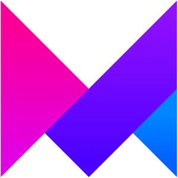
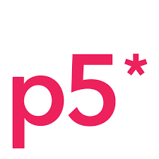

### Hi there, I'm DainPark - aka [DainPark-web][website] 👋

<!-- 
 -->

## I'm a Front end Developer and UXUI Designer!!

- 🔭 I'm also learning Backend to become a Full-Stack.
- 🌱 I’m currently learning everything(UXUI, Full-Stack) 🤣
- 🥅 2021 Goals: I'm going to make a web service.
- ⚡ Fun fact: I love to draw with coding(P5.js, P3, GLSL, Three.js)

### Connect with me:

<!-- [][website] -->
<!-- [][youtube] -->
<!-- [][twitter] -->
[][linkedin]
[][instagram]

 

### Languages and Tools:

 
 

<!-- ### 📺 Latest YouTube Videos -->

<!-- YOUTUBE:START -->
<!-- - [VS Code Has Dev Tools & Console!! No Need For Chrome Anymore 👋](https://www.youtube.com/watch?v=vHZPeohPHqo)
- [⭐ BONUS: STACKr News Shorts - BYE BYE VS CODE ??](https://www.youtube.com/watch?v=r2ha0n2s3wE)
- [⭐ BONUS: STACKr News Shorts - 5 Things Better in Svelte than React](https://www.youtube.com/watch?v=I-8aVr7vnlA)
- [Bootcamp Graduate Advice 💪, Who's the CSS King? 👑, GitHub Copilot 🤖 // STACKr News Weekly - Issue 5](https://www.youtube.com/watch?v=F6KzVOrhEXw)
- [STACKr News Shorts - Issue 4 - Syntax.fm Potluck](https://www.youtube.com/watch?v=x8HNcal4fw0)
<!-- YOUTUBE:END -->

<!-- ### 📕 Latest Blog Posts -->

<!-- BLOG-POST-LIST:START -->
<!-- - [How To Pass Application Tracking Systems (ATS) & Get Interviews - Resume Tips for Software Developer](https://dev.to/codestackr/how-to-pass-application-tracking-systems-ats-get-interviews-resume-tips-for-software-developer-4bmo)
- [Microinteractions: Password Validation Animation](https://dev.to/codestackr/microinteractions-password-validation-animation-5629)
- [Notion + YouTube - A Powerful Combination for Productivity](https://dev.to/codestackr/notion-youtube-a-powerful-combination-for-productivity-1def)
- [Regular Expressions (RegEx) Crash Course](https://dev.to/codestackr/regular-expressions-regex-crash-course-248n)
- [Emmet Part 2 - Advanced](https://dev.to/codestackr/emmet-part-2-advanced-4c65)
<!-- BLOG-POST-LIST:END -->

<!-- 

  
:zap: Recent GitHub Activity
 -->
  
<!--START_SECTION:activity-->
<!-- 1. 🗣 Commented on [#2](https://github.com/codeSTACKr/portfolio-sass/issues/2) in [codeSTACKr/portfolio-sass](https://github.com/codeSTACKr/portfolio-sass)
2. ❗️ Closed issue [#2](https://github.com/codeSTACKr/portfolio-sass/issues/2) in [codeSTACKr/portfolio-sass](https://github.com/codeSTACKr/portfolio-sass)
3. ❌ Closed PR [#11](https://github.com/codeSTACKr/free-developer-resources/pull/11) in [codeSTACKr/free-developer-resources](https://github.com/codeSTACKr/free-developer-resources)
4. 🗣 Commented on [#11](https://github.com/codeSTACKr/free-developer-resources/issues/11) in [codeSTACKr/free-developer-resources](https://github.com/codeSTACKr/free-developer-resources)
5. 🎉 Merged PR [#10](https://github.com/codeSTACKr/free-developer-resources/pull/10) in [codeSTACKr/free-developer-resources](https://github.com/codeSTACKr/free-developer-resources) -->
<!--END_SECTION:activity-->

<!-- 
 -->

<!-- 

  
:zap: GitHub Stats

  

 -->

<!-- [website]: https://codeSTACKr.com
[course]: http://vsCodeHero.com
[twitter]: https://twitter.com/codeSTACKr
[youtube]: https://youtube.com/codeSTACKr -->
[instagram]: https://www.instagram.com/yourpark_dainpark/
[linkedin]: https://www.linkedin.com/in/dain-park-485b82196/
<!-- [webdevplaylist]: https://www.youtube.com/playlist?list=PLkwxH9e_vrAJ0WbEsFA9W3I1W-g_BTsbt
[jsplaylist]: https://www.youtube.com/playlist?list=PLkwxH9e_vrALRJKu7wfXby3MKeflhTu6B
[cssplaylist]: https://www.youtube.com/playlist?list=PLkwxH9e_vrALSdvZuEh6gqQdmDoDIoqz4
[reactplaylist]: https://www.youtube.com/playlist?list=PLkwxH9e_vrAK4TdffpxKY3QGyHCpxFcQ0 -->
